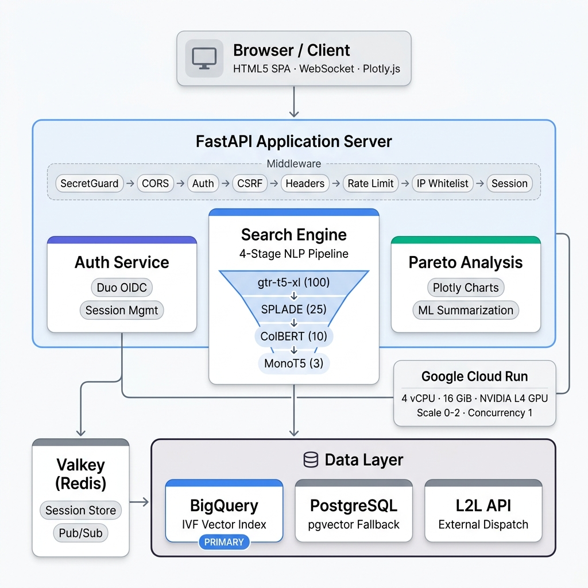

# Intelligent Incident Retrieval System

**Production-grade ML-powered semantic search platform for industrial maintenance**

`FastAPI` · `Python 3.12` · `PyTorch` · `Google Cloud Run (NVIDIA L4 GPU)` · `RAG` · `4-Stage NLP Reranking`

---

## Business Objective

Eliminate the time maintenance technicians spend manually searching through logs across different shifts. The previous workflow relied on **tribal knowledge**, **manual documentation on paper**, and **diagnosing problems from scratch** with no way to know whether the current issue was recurrent or new.

This system replaces that with instant, semantically-aware retrieval that understands intent — not just keywords. It significantly reduces dependence on tribal knowledge, speeds up problem resolution, and surfaces notes from previous fixes including what machine parts were used during similar repairs.

**The result: a projected 40% drop in MTTR (Mean Time To Repair), directly reducing machine downtime.**

---

## What It Does

| Feature | Description |
|---|---|
| **Semantic Search** | Free-text incident descriptions are matched against 100,000+ historical dispatches using dense vector similarity and multi-model reranking — going well beyond keyword matching to understand intent and context |
| **Dispatch Lookup** | Direct lookup by dispatch number against the Leading2Lean external API, with retry/backoff logic |
| **Pareto Analysis** | Recurring failure patterns surfaced with drill-down by production line and machine, including nested subcategories and ML-powered problem description summarization. Powered by interactive Plotly charts |
| **Real-time Streaming** | WebSocket connections push pipeline progress and results to the client as each stage completes — live feedback without polling |

---

## Results

- 🎯 **90%+ recommendation accuracy** across various machines inside the factory
- ⚡ **Projected 40% MTTR reduction** by matching failure descriptions against 100K+ historical dispatches
- 🔒 **Enterprise-grade security** — Duo OIDC authentication, CSRF protection, rate limiting, sensitive information redaction, Google Secret Manager
- 📊 **Nested Pareto analysis** with ML-integrated summarization for problem descriptions over time
- 💰 **Scale-to-zero architecture** eliminated GPU costs during off-hours, avoiding unnecessary ongoing charges
- 🔄 **Real-time WebSocket streaming** delivers progressive results as each pipeline stage completes

---

## System Architecture

The system is structured as a layered request pipeline with strict middleware ordering, separating security concerns from business logic:

<p align="center">
  
</p>

---

## NLP Reranking Pipeline

The core of the system is a **4-stage funnel architecture**. Each stage narrows the candidate set using an increasingly powerful — and more expensive — model, balancing latency against retrieval precision.

```
STAGE 1 — RECALL          STAGE 2 — LEXICAL       STAGE 3 — DENSE         STAGE 4 — PRECISION
Vector Similarity          SPLADE Rerank            ColBERT Rerank          MonoT5 Final
──────────────────         ─────────────────        ──────────────────      ─────────────────
BigQuery COSINE search  →  Sparse-dense hybrid   →  Late-interaction     →  Cross-encoder scoring
100 candidates             25 candidates            10 candidates           3 results
gtr-t5-xl                  SPLADE-CoCondenser        ColBERTv2.0             MonoT5-3B
```

### Why Four Stages?

Running a cross-encoder like MonoT5 over the full corpus of 100,000+ dispatches on every query would be prohibitively slow. The funnel architecture lets the cheap vector search cast a wide net (100 candidates), then progressively expensive rerankers refine the set:

- **SPLADE** catches lexical matches that embeddings miss — exact part numbers, error codes, machine identifiers
- **ColBERT** adds contextual density through late-interaction token matching
- **MonoT5** makes the final precision call on the shortlisted 10, producing the 3 results surfaced to the technician

### Model Management

| Feature | Detail |
|---|---|
| **Singleton Lifecycle** | All models managed by `NLPModelManager` — loaded once, shared across requests. No per-request instantiation |
| **Per-Model Device Assignment** | Embedding model on CPU; rerankers (SPLADE, ColBERT, MonoT5) on GPU — balanced across L4's 24 GB VRAM |
| **Precision Control** | Default `float32`, configurable `bfloat16` to halve GPU memory at minimal accuracy cost |
| **Cython Fast-Path** | OpenMP-accelerated similarity computation outside the GIL; transparent fallback to PyTorch in development |
| **Concurrency Guards** | Semaphores: 8 max NLP tasks, 2 concurrent encoding ops, 1 reranking op at a time |

---

## Technology Stack

### Backend & NLP

| Layer | Technology |
|---|---|
| Web Framework | FastAPI with Uvicorn (ASGI) |
| Language | Python 3.12 |
| Embedding Model | `gtr-t5-xl` via Sentence-Transformers (768-dim vectors) |
| Rerankers | SPLADE-CoCondenser, ColBERTv2.0, MonoT5-3B (via Rankify) |
| ML Runtime | PyTorch 2.2.2 with CUDA 12.1 |
| Native Acceleration | Cython + OpenMP for GIL-free parallel similarity computation |
| Primary Database | Google BigQuery with IVF vector index (COSINE distance) |
| Fallback Database | PostgreSQL + pgvector extension |
| Session Store | Valkey (Redis-compatible) with connection pooling |
| External API | Leading2Lean Dispatch API with retry/backoff |

### Security Infrastructure

| Layer | Technology |
|---|---|
| Authentication | Duo Security OIDC via Authlib |
| Secrets Management | HashiCorp Vault (KV v1/v2) — local; Google Cloud Secret Manager — cloud |
| Session Storage | Valkey with TTL-based expiry (sliding + absolute timeouts) |
| CSRF Protection | Double-submit cookie with constant-time comparison |
| Rate Limiting | SlowAPI — per-IP, per protected endpoint |

### Cloud & Deployment

| Layer | Technology |
|---|---|
| Container Runtime | Docker on NVIDIA CUDA 12.1 base image |
| Compute | Google Cloud Run — 4 vCPU, 16 GiB RAM, 1× NVIDIA L4 GPU |
| Scaling | 0–2 instances, concurrency 1 (GPU-bound workload) |
| CI/CD | Google Cloud Build → Artifact Registry → Cloud Run deploy |
| Region | us-east4 |
| Monitoring | Prometheus metrics endpoint + structured JSON logging |

### Frontend

| Layer | Technology |
|---|---|
| Approach | Vanilla HTML5/CSS3/JavaScript SPA (no build tools or frameworks) |
| Charting | Plotly.js for Pareto analysis visualizations |
| Real-time | Native WebSocket API for live result streaming |
| Session UI | Custom session manager with activity tracking, profile modal, auto-expiry |

---

## Key Architectural Decisions

### Single-Worker Per Instance (Concurrency = 1)

Each Cloud Run instance runs exactly one Uvicorn worker. This is deliberate: running multiple workers on a shared NVIDIA L4 would cause GPU memory contention and make model lifecycle management unpredictable. Constraining concurrency to 1 eliminates that problem class entirely, trading raw throughput for operational stability and deterministic memory behaviour.

### Thread Hardening at Startup

`OMP_NUM_THREADS`, `MKL_NUM_THREADS`, and related environment variables are pinned before any library import. PyTorch, NumPy, and OpenMP can each spawn hundreds of threads on startup if unconstrained; on a 4-vCPU Cloud Run instance this causes severe oversubscription. Thread limits are enforced at process start, before any import can trigger library initialization.

### Lazy Model Loading via Centralized Registry

All heavy dependencies (PyTorch, Transformers, Sentence-Transformers) are loaded through a centralized `shared_imports.py` registry. Models are instantiated on first use, not at startup. This reduced cold-start RAM from ~28 GB to ~18 GB — approximately a **30% reduction** — providing a smoother, more stable user experience and making the system feasible on the 16 GiB Cloud Run tier with GPU offload.

### Database Failover with Degraded-Mode Fallback

BigQuery is the primary vector store, supporting IVF-indexed COSINE similarity at scale. If BigQuery becomes unreachable, the system **automatically falls back** to a PostgreSQL instance running pgvector, which performs ILIKE keyword matching as a degraded but functional alternative. This keeps the system operational during cloud outages, even at reduced retrieval quality.

### Scale-to-Zero with Cold-Start Awareness

Minimum instances is set to 0 to eliminate GPU costs during off-hours. Maximum is capped at 2 to control spend. The first request after inactivity triggers a cold start where all four NLP models are loaded. This tradeoff is intentional for an internal tool with predictable shift-based usage patterns.

### Graceful Shutdown

`SIGINT`/`SIGTERM` signal handlers drain in-flight requests, unload models, close connection pools, and clean up multiprocessing semaphores before the container exits. This prevents GPU memory leaks and connection pool exhaustion during Cloud Run rolling deployments.

---

## Security Posture

### Authentication

Users authenticate through Duo Security's OIDC provider. The login flow generates a cryptographic state parameter and nonce for replay prevention, redirects to Duo, then exchanges the authorization code for tokens on callback. ID tokens are validated against Duo's JWKS endpoint. No passwords are stored or handled by the application.

### Session Management

Sessions live in Valkey — not on the filesystem or in cookies — with a dual-timeout strategy:

- **Idle timeout (60s):** Valkey key TTL is refreshed on each request via a sliding window. Sessions expire one minute after the last interaction.
- **Absolute timeout (30 min):** Regardless of activity, the session is destroyed 30 minutes from login, limiting the damage window if a session token is compromised.

Session tokens are generated with `secrets.token_urlsafe(32)` (~256 bits of entropy). Token rotation is handled atomically via Redis pipelines. Forced logout across all of a user's sessions is supported through Redis Pub/Sub.

### Request Protection

- **CSRF** — Double-submit cookie pattern. Token generated with `secrets.token_hex(32)`, validated with `secrets.compare_digest` (constant-time to prevent timing attacks)
- **Input Validation** — All payloads validated through Pydantic models. Query text sanitized (HTML chars stripped, whitespace normalized). Field lengths capped: query 1000 chars, machine 128 chars, dispatch 64 chars
- **Rate Limiting** — SlowAPI enforces per-IP request limits on every protected endpoint
- **Request Size Limiting** — Bodies over 512 KB are rejected before reaching application code

### Transport & Headers

Every response includes hardened HTTP headers:

- **HSTS** — 2-year max-age, `includeSubDomains`, `preload`
- **Content-Security-Policy** — scoped to `self` with strict rules in production (no inline scripts); relaxed only in development
- **X-Frame-Options: DENY** — blocks clickjacking
- **Referrer-Policy: no-referrer** — with locked-down Permissions-Policy (no geolocation, microphone, or camera access)

Session cookies are marked `Secure` and `SameSite=Strict` in production.

### Secrets & Credentials

No secrets are stored in code or config files. Credentials are retrieved from HashiCorp Vault (KV v1/v2) at runtime, falling back to environment variables when Vault is unavailable. In cloud deployment, API keys are injected from Google Cloud Secret Manager.

### Logging & Data Redaction

A `RedactSensitiveFilter` is applied to all loggers. It automatically strips email addresses, hex tokens, Bearer credentials, API key values, and session identifiers from log output before it reaches any sink. Error responses to clients return only an opaque error ID and timestamp — stack traces and internal context remain server-side only.

### Network Controls

- **CORS** — explicit origin allowlist from environment variables
- **IP Whitelist Middleware** — optionally restricts access to known networks, with `X-Forwarded-For` support behind Cloud Run's load balancer
- **Internal Dispatch Proxy** — requires a shared `X-Internal-Secret` header, preventing use as an open relay
- **Cloud Run IAM** — no unauthenticated access; all requests pass Google's IAM layer before reaching the application

---

## Role

**Sole developer and product owner.** Owned the full SDLC — from data ingestion and model selection to deployment, security hardening, stakeholder iteration, and production maintenance. This project demonstrates the ability to independently own, build, and ship production ML systems end-to-end.

---

*Built with FastAPI, PyTorch, and a 4-stage NLP reranking pipeline. Deployed on Google Cloud Run with NVIDIA L4 GPU.*
